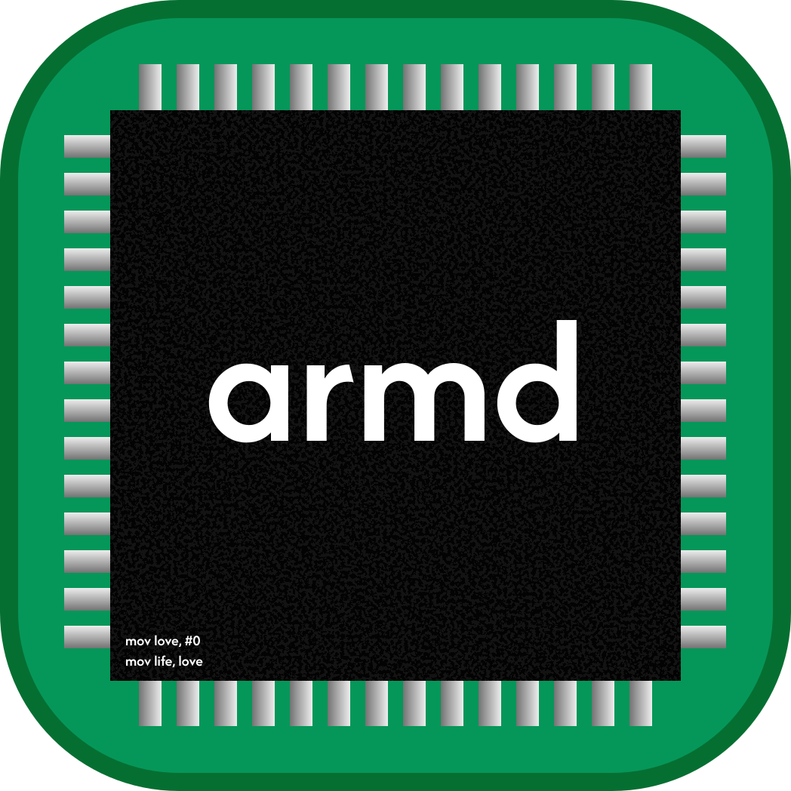

<p align="center">
  
</p>

<h1 align="center">ARMd</h1>

<p align="center">
  Write and run Keil-style ARM7 assembly on an Apple Silicon Mac.
</p>

Built for Embedded Systems Lab. ARMd transpiles your `.s` file to native AArch64 and runs it directly — programs execute at full speed rather than being interpreted.

## Requirements

macOS 15 or later.

Apple's Command Line Tools are required, and ARMd installs them for you the first time you open it — there is nothing to set up beforehand.

## Install

Paste this into Terminal:

```
brew install --cask atpugvaraa/atpugvaraa/armd
```

That's it — ARMd lands in your Applications folder and opens straight away. It's signed and notarised by Apple, so there's no "unidentified developer" warning and nothing to right-click.

No Homebrew? Install it first with the one line from [brew.sh](https://brew.sh), then run the command above.

Prefer not to use Terminal at all? Download the `.app` from [Releases](https://github.com/atpugvaraa/ARMd/releases/latest) and drag it to Applications.

To update later: `brew upgrade --cask armd`

## Using it

Open a folder of `.s` files from the sidebar, click one to load it into the editor, and press ⌘R to build and run.

The editor has two tabs. **Edit** is where you type. **Debug** appears once a run has produced a trace: step through it with `⌘[` / `⌘]`, and registers and memory on the right track whichever instruction you're stopped at. ⌘R switches you to Debug automatically; click Edit to go back to typing.

For exercises that read memory the program itself never writes, set those values first with the pencil button in the Memory pane's header.

`⌘+` and `⌘−` resize the code, registers and console together; `⌘0` puts them back.
